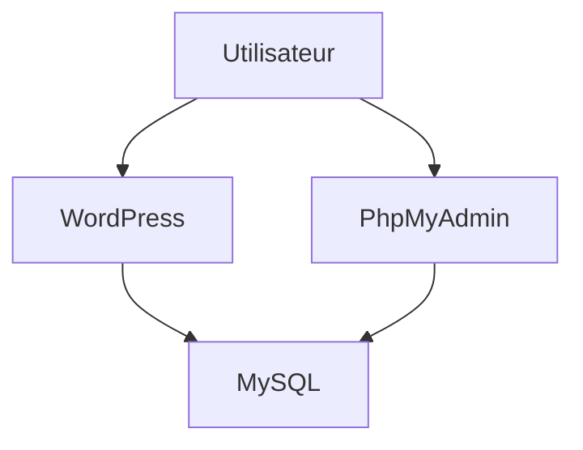

## Case 1 — Debug WordPress + MySQL

### 🎯 Objectif
Déployer une stack WordPress avec MySQL et PhpMyAdmin fonctionnelle, en corrigeant les erreurs de configuration initiales.

---

## 🔍 1. Debugging

### 1. Démarrage de la stack pour observer le comportement initial
```bash
docker compose up -d
```

### 2. Vérification de l’état des conteneurs
```bash
docker compose ps -a
```
→ Conteneurs créés mais non démarrés

### 3. Démarrage en mode interactif pour identifier l’erreur bloquante
```bash
docker compose up
```
→ Erreur : port MySQL `3306` déjà utilisé sur l’hôte

### 4. Première correction
- Suppression de l’exposition du port `3306` car inutile pour la communication interne entre conteneurs

### 5. Analyse des logs MySQL
```bash
docker compose logs mysql
```
→ Erreur : `MYSQL_ROOT_PASSWORD` manquant, obligatoire avec MySQL 8

### 6. Seconde correction
- Ajout de `MYSQL_ROOT_PASSWORD`
- Externalisation des variables via `.env`

### 7. Redémarrage propre pour réinitialiser la base
```bash
docker compose down -v
docker compose up -d
```

### 8. Validation finale
```bash
docker compose ps
```

Accès applicatif :
- http://localhost:8080
- http://localhost:8081

---

## ⚙️ 2. Bonnes pratiques appliquées

### 🔐 Sécurité
- Suppression de l’exposition du port MySQL
- Restriction des ports web sur `127.0.0.1`
- Externalisation des variables sensibles dans `.env`

### 🌐 Réseau
- Ajout d’un réseau Docker dédié `wordpress_net`
- Isolation de la stack

### 🩺 Healthcheck & dépendances
- Ajout d’un healthcheck MySQL avec `mysqladmin ping`
- `depends_on` conditionné à `service_healthy`

### 🧩 Configuration
- Séparation des variables d’environnement par service : WordPress, MySQL, PhpMyAdmin

---

## 🏗️ 3. Architecture



---

## 📦 4. Améliorations supplémentaires

- Utilisation de versions d’images spécifiques au lieu de `latest`
- Ajout d’un fichier `.env.example`
- Ajout d’un réseau dédié par stack

---

## 🧠 Conclusion

Les problèmes principaux provenaient :
- d’un conflit de port sur `3306`
- d’une mauvaise configuration MySQL avec une variable obligatoire manquante

La résolution a été faite de façon méthodique :
- analyse des logs
- identification de la cause racine
- corrections minimales
- validation fonctionnelle
